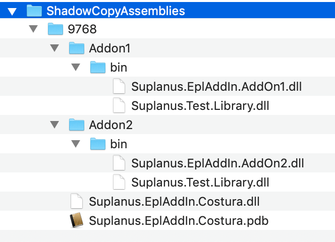

A demo project for showing merging DLLs for EPLAN API addin.
Also a demo how to use the same library (DLL) in different addins.

- [❌ Costura](#%e2%9d%8c-costura)
- [❌ AddOn](#%e2%9d%8c-addon)

---

## ❌ Costura

**Description**

[Fody.Costura](https://github.com/Fody/Costura) is a simple way to merge DLLs/EXE. This would be the best solution.

**Problem**

Strong name signing failed: 
Only the main DLL is signed. If you call a method from other dll an exception is thrown:
```
Die Datei oder Assembly Suplanus.EplAddIn.Library, Version=1.0.0.0, Culture=neutral, PublicKeyToken=8f3e3d4bbc0785ed oder eine Abhängigkeit davon wurde nicht gefunden.
```

**Reproduce**

- Build the project in Release mode
- Sign the assembly
- Load with Runtime License

[**Example**](https://github.com/Suplanus/Suplanus.Eplan.MergeExample/tree/master/Examples/Costura)

---

## ❌ AddOn

**Description**

Each Addin is packed in a EPLAN Addon

**Problem**
The DLLs are saved in different directories. Thats good. But EPLAN can only load one assembly with same name. So if you call `AddOn2` Action it displays `1` not `2`.



**Reproduce**

- Build the project1 in Release mode
- Sign the assembly
- Create Addon1
- Change `Suplanus.Test.Library.Normal()` from `1` to `2`
- Build the project2 in Release mode
- Sign the assembly
- Create Addon2
- Load the addons
- Execute Actions

[**Example**](https://github.com/Suplanus/Suplanus.Eplan.MergeExample/tree/master/Examples/AddOn)